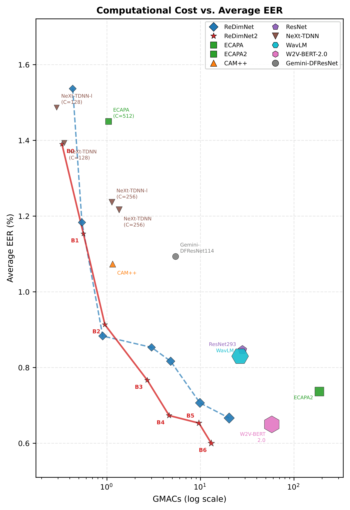

# ReDimNet2: Scaling Speaker Verification via Time-Pooled Dimension Reshaping

> **Anonymous submission to Interspeech 2026**
>
> This repository contains the official implementation and pretrained weights for the paper *"ReDimNet2: Scaling Speaker Verification via Time-Pooled Dimension Reshaping"*.

## Overview

ReDimNet2 extends the [ReDimNet](https://github.com/IDRnD/redimnet) dimension-reshaping framework by introducing pooling over the time dimension in the 1D processing pathway. This allows significantly more aggressive channel scaling without proportional compute increase, yielding a strictly better accuracy–efficiency Pareto front at every scale point.

<p align="center">
  
</p>

## Results

All models trained on VoxCeleb2-dev. EER (%) on VoxCeleb1 cleaned protocols:

| Model | Params | GMACs | Vox1-O | Vox1-E | Vox1-H |
|:---|:---:|:---:|:---:|:---:|:---:|
| ReDimNet2-B0 | 1.1M | 0.33 | 1.04 | 1.16 | 1.97 |
| ReDimNet2-B1 | 2.1M | 0.56 | 0.78 | 0.96 | 1.72 |
| ReDimNet2-B2 | 3.6M | 0.95 | 0.57 | 0.76 | 1.41 |
| ReDimNet2-B3 | 4.1M | 2.70 | 0.42 | 0.66 | 1.22 |
| ReDimNet2-B4 | 6.6M | 4.62 | 0.37 | 0.58 | 1.07 |
| ReDimNet2-B5 | 8.9M | 9.62 | 0.33 | 0.56 | 1.07 |
| ReDimNet2-B6 | 12.3M | 13.05 | 0.29 | 0.52 | 0.99 |

## Quick Start

### Via torch.hub

```python
import torch
import torchaudio

model = torch.hub.load("PalabraAI/redimnet2", "redimnet2", model_name="b6", train_type="lm", pretrained=True)
model.eval()

waveform, sr = torchaudio.load("audio.wav")
# waveform: (batch, samples), 16 kHz
with torch.no_grad():
    embedding = model(waveform)  # (batch, emb_dim)
```

Available model names: `b0`, `b1`, `b2`, `b3`, `b4`, `b5`, `b6`.
Available train types: `ptn` (pretraining), `lm` (large-margin fine-tuning, recommended).

### Local installation

```bash
git clone https://github.com/PalabraAI/redimnet2.git
cd redimnet2
pip install -r requirements.txt
```

```python
from redimnet2 import ReDimNet2

model = ReDimNet2.from_pretrained("b3", train_type="lm")
```

## Model Zoo

Pretrained weights are available as GitHub Release assets:

| Config | Pretraining (ptn) | Large-Margin (lm) |
|:---|:---|:---|
| B0 | [b0-vox2-ptn.pt](https://github.com/PalabraAI/redimnet2/releases/download/v1.0.0/b0-vox2-ptn.pt) | [b0-vox2-lm.pt](https://github.com/PalabraAI/redimnet2/releases/download/v1.0.0/b0-vox2-lm.pt) |
| B1 | [b1-vox2-ptn.pt](https://github.com/PalabraAI/redimnet2/releases/download/v1.0.0/b1-vox2-ptn.pt) | [b1-vox2-lm.pt](https://github.com/PalabraAI/redimnet2/releases/download/v1.0.0/b1-vox2-lm.pt) |
| B2 | [b2-vox2-ptn.pt](https://github.com/PalabraAI/redimnet2/releases/download/v1.0.0/b2-vox2-ptn.pt) | [b2-vox2-lm.pt](https://github.com/PalabraAI/redimnet2/releases/download/v1.0.0/b2-vox2-lm.pt) |
| B3 | [b3-vox2-ptn.pt](https://github.com/PalabraAI/redimnet2/releases/download/v1.0.0/b3-vox2-ptn.pt) | [b3-vox2-lm.pt](https://github.com/PalabraAI/redimnet2/releases/download/v1.0.0/b3-vox2-lm.pt) |
| B4 | [b4-vox2-ptn.pt](https://github.com/PalabraAI/redimnet2/releases/download/v1.0.0/b4-vox2-ptn.pt) | [b4-vox2-lm.pt](https://github.com/PalabraAI/redimnet2/releases/download/v1.0.0/b4-vox2-lm.pt) |
| B5 | [b5-vox2-ptn.pt](https://github.com/PalabraAI/redimnet2/releases/download/v1.0.0/b5-vox2-ptn.pt) | [b5-vox2-lm.pt](https://github.com/PalabraAI/redimnet2/releases/download/v1.0.0/b5-vox2-lm.pt) |
| B6 | [b6-vox2-ptn.pt](https://github.com/PalabraAI/redimnet2/releases/download/v1.0.0/b6-vox2-ptn.pt) | [b6-vox2-lm.pt](https://github.com/PalabraAI/redimnet2/releases/download/v1.0.0/b6-vox2-lm.pt) |

## Citation

```bibtex
@inproceedings{redimnet2_2026,
  title={ReDimNet2: Scaling Speaker Verification via Time-Pooled Dimension Reshaping},
  author={Anonymous},
  booktitle={Submitted to Interspeech 2026},
  year={2026}
}
```

## License

MIT
